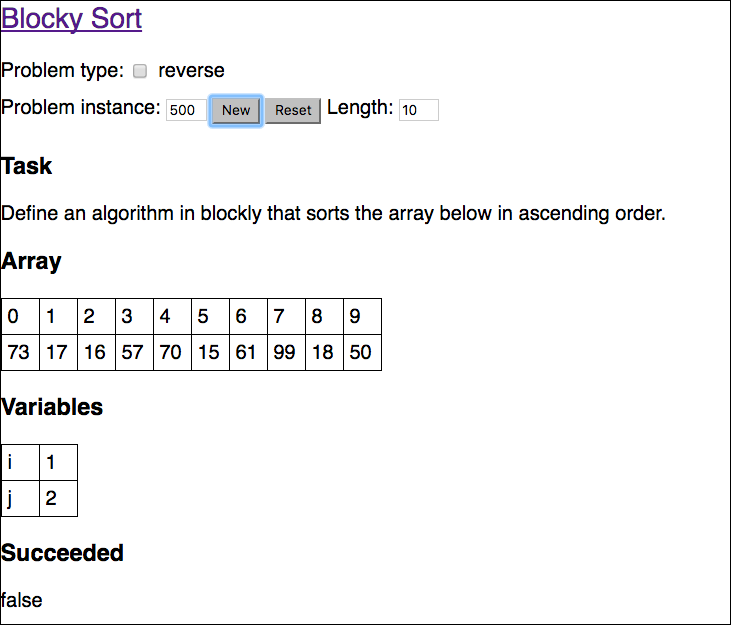

# Blockly Algorithms

This project provides exercises to formulate algorithms for basic
computer science algorithms made for students without programming
knowledge.  To this end, the project uses <a
href="https://developers.google.com/blockly/">Google's Blockly</a>
to allow students to assemble their algorithms. In contrast to
[Google's Blockly Games](https://blockly-games.appspot.com/?lang=en),
which allows to define simple programs, this project focuses on
algorithms, where each algorithm can solve a class of problems.

The site is entirely written in html and java script. In principle,
there are no server processes needed.

You can find a demo [here](http://robin.aly.de/blockly-algorithms/)

## Requirements

This project has been only tested on Chrome 53.0.2785.116 (64-bit).
It is known that the pages are not displaying correctly under older
version of Firefox.

## Usage

You can use the ``start_dev.bash`` script to start a web server on
your computer or upload the project to a web space of your choice.

## Example

To be more concrete, one of the problems is sorting numbers, which
is displayed as follows:

A possible solution in blockly might looks like this:

